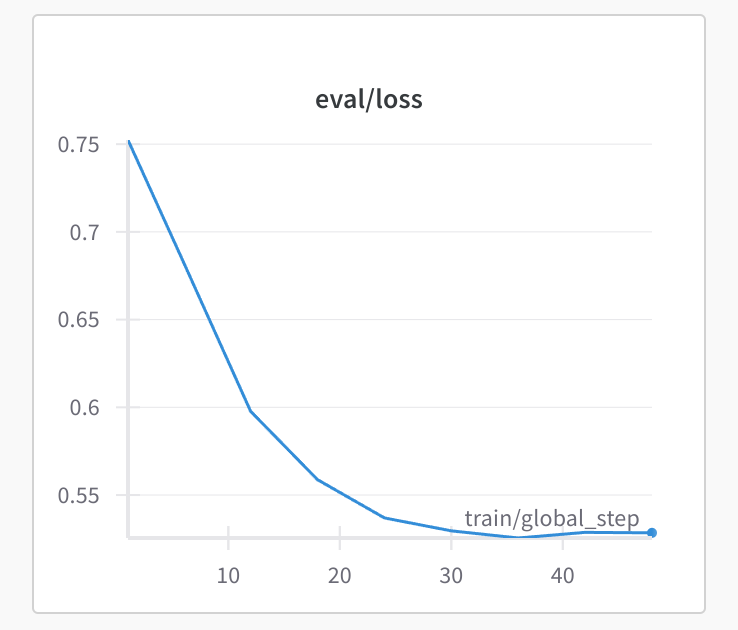

Automates training small, slim Llama 3.1-based LoRAs!

Sets up known-good training configs for training LoRA-based finetunes for up to
8192 tokens, so you don't have to think about any of the system-level details
of model training and can focus on curating good datasets and selecting
training parameters (instead of experimenting with batch sizes and gradient
accumulation steps just trying to get your training job to run). Automatically
handles multi-GPU training for you when necessary! Supports both Llama 3.1 8B
Instruct, and Llama 3.1 70B Instruct.

Includes helpers for:

* Extracting distillation data from existing models
* Pulling training data from Hugging Face datasets and/or JSONL files
* Training models with known-good configurations on your own GPUs, or on
  [Together.ai](https://together.ai)'s cloud-hosted finetuning platform
* Tracking training and eval progress on [Weights & Biases](https://wandb.ai/)

### Comparison with other tools

* __Unsloth__: While Unsloth is *very* fast (hence the name), it only supports
  single-GPU training: so you can't train an unquantized 70B model, and
  [quantizing past FP8 can significantly harm model
  performance](https://arxiv.org/pdf/2411.04330). It's also a lower-level
  Python API that assumes significantly more knowledge of the LLM training
  ecosystem.
* __Axolotl__: Axolotl supports many, many different models and ways of
  training models... But requires lots of configuration, along with
  trial-and-error around system performance tuning of things like batch sizes,
  sharding, and gradient accumulation steps in order to get jobs to run. Unfat
  can generate known-good Axolotl configurations for you, so you don't have to
  do that yourself.

### Why LoRAs?

LoRAs are fast and cheap to train, and result in tiny files that can
efficiently be kept in VRAM, while still significantly improving task
performance compared to the underlying base model. For example, [this R1
distill LoRA](https://huggingface.co/reissbaker/r1-llama-70b-distill-lora)
built on top of Llama 3.1 70B Instruct improves MATH-500 and GPQA-Diamond
performance by 50%, and doubles AIME24 performance, compared to the untrained
model. Sites like [GLHF](https://glhf.chat) support running arbitrary LoRAs of
[certain base models](https://glhf.chat/pricing#Multi-LoRA) at cheap per-token
prices that are equivalent to the underlying base models — typically this is a
lot cheaper than renting out enough GPUs to run a full-parameter finetune.

You can do much more than just improving at benchmarks, though; you can modify
models pretty much however you want. For example, [this 70b
LoRA](https://huggingface.co/reissbaker/llama-3.1-70b-abliterated-lora)
uncensors Llama 3.1 70B by distilling from a large uncensored model, something
that isn't possible with prompt engineering alone.

## Getting started

Install unfat using `uv` (or your favorite Python package manager):

```bash
uv init <project-name>
uv add unfat
```

Unfat supports distilling from larger models and/or training on your own data,
and a few different ways to actually train the models and run them. Feel free
to keep reading this guide straight through as an example of training a small
model by distilling DeepSeek-R1, or jump around to the sections below:

* [Extracting distillation data](#extracting-distillation-data)
* [Starting a finetune job](#starting-a-finetune-job)
* [Running your LoRA](#running-your-lora)
* [Training on your own JSONL files](#training-on-your-own-jsonl-files)
* [Training on Hugging Face datasets](#training-on-hugging-face-datasets)
* [Distilling with your own custom prompts](#distilling-with-your-own-custom-prompts)
* [Tracking with Weights & Biases](#tracking-with-weights--biases)
* [Anthropic-compatible clients](#anthropic-compatible-clients)

## Extracting distillation data

Let's train a quick Llama 3.1 8B Instruct LoRA by distilling DeepSeek-R1.

Here's a sneak peek at the eval loss graph — it really works!



First, we'll get some datasets and extract completions from R1 by querying the
OpenAI-compatible [glhf.chat](https://glhf.chat) API (or any OpenAI-compatible
API should work):

```python
from unfat.datasets import hub_prompts, hub_subsets, HubSplit, Dataset, HubSubset
from unfat.extract import Extractor
from unfat.client import OpenAiCompatClient
import os

output_dir = "output"
extractor = Extractor(
    max_concurrent=30,
    output_dir=output_dir,
    client=OpenAiCompatClient(
        model="hf:deepseek-ai/DeepSeek-R1",
        base_url="https://glhf.chat/api/openai/v1",
        api_key=os.environ["GLHF_API_KEY"],
    ),
    dataset=Dataset(
        train=[
            # Use some simple chat messages to extract prompts that need less
            # thinking:
            hub_prompts(
                name="mlabonne/harmless_alpaca",
                text_field="text",
                split=HubSplit(name="train", max_rows=100),
            ),
            # Use a few rows of each subset of the train set of hendrycks_math
            # to extract harder prompts:
            hub_subsets(
                name="EleutherAI/hendrycks_math",
                text_field="problem",
                subsets=[
                    HubSubset(
                        name="geometry",
                        split=HubSplit(name="train", max_rows=30),
                    ),
                    HubSubset(
                        name="intermediate_algebra",
                        split=HubSplit(name="train", max_rows=30),
                    ),
                    HubSubset(
                        name="number_theory",
                        split=HubSplit(name="train", max_rows=30),
                    ),
                    HubSubset(
                        name="precalculus",
                        split=HubSplit("train", max_rows=30),
                    ),
                ],
            ),
        ],
        eval=[
            # Test on the test sets
            hub_prompts(
                name="mlabonne/harmless_alpaca",
                text_field="text",
                split=HubSplit(name="test", max_rows=10),
            ),
            hub_subsets(
                name="EleutherAI/hendrycks_math",
                text_field="problem",
                subsets=[
                    HubSubset(
                        name="geometry",
                        split=HubSplit(name="test", max_rows=30),
                    ),
                    HubSubset(
                        name="intermediate_algebra",
                        split=HubSplit(name="test", max_rows=30),
                    ),
                    HubSubset(
                        name="number_theory",
                        split=HubSplit(name="test", max_rows=30),
                    ),
                    HubSubset(
                        name="precalculus",
                        split=HubSplit("test", max_rows=30),
                    ),
                ],
            ),
        ],
    ),
)
```

Next, let's run the extraction. This should take around 20mins and cost
around $10 in API credits:

```python
extractor.run()
```

Now you should have all the data you need for training. Unfat can generate
training jobs for you in two ways:

1. By generating Axolotl configs you can run on A100s/H100s, or
2. By creating jobs on Together.ai's fine-tuning platform.

If you have your own A100/H100 GPUs, we recommend using Axolotl. Otherwise, we
recommend running the jobs on Together.ai for simplicity.

## Starting a finetune job

### Finetune using Together.ai

If you don't want to manage GPUs yourself, Unfat supports automatically
uploading and starting jobs on Together.ai's finetuning platform. First,
create an account and export a `TOGETHER_API_KEY` in your shell environment.
Then you can simply do as follows:

```python
from unfat.together import llama_3_1_8b_together
from unfat.lora import LoraSettings

train_config = llama_3_1_8b_together(
    output_dir=output_dir,
    dataset=extractor.output_dataset(),
    settings=LoraSettings(
        rank=32,
        alpha=16,
        dropout=0.01,
        num_epochs=8,
        learning_rate=4e-4,
    ),
    api_key=os.environ["TOGETHER_API_KEY"],
)
uploaded_files = together_config.upload_files()
together_config.finetune(uploaded_files)
```

This should take around 10mins and cost around $6 in credits.

Once it's done, you can log into your Together account and download the final
LoRA checkpoint. Together (unfortunately) generates an invalid
`adapter_config.json`: it sets `base_model_name_or_path` to an
internally-hosted model rather than the actual base model; make sure to rewrite
that to `"meta-llama/Meta-Llama-3.1-8B-Instruct"` before publishing or pushing
to Hugging Face.

### Finetune using Axolotl

[Axolotl](https://github.com/axolotl-ai-cloud/axolotl) is an open-source
fine-tuning framework. Unfat can automatically generate Axolotl training
configs for you by making some assumptions:

* For Llama 3.1 8B finetunes, we assume one H100/A100 GPU is being used.
* For Llama 3.1 70B finetunes, we assume 8xH100s or 8xA100s.

If you don't have machines of this size yourself, we recommend using
[Runpod](https://www.runpod.io/) to rent them.

To generate the configs:

```python
from unfat.axolotl import llama_3_1_8b_axolotl
from unfat.lora import LoraSettings

lora_settings = LoraSettings(
    rank=32,
    alpha=16,
    dropout=0.01,
    num_epochs=8,
    learning_rate=4e-4,
)
train_config = llama_8b_axolotl(
    dataset=extractor.output_dataset(),
    settings=lora_settings,
    warmup_steps=10,
)

train_config.save(output_dir)
```

Now you should have a `config.yaml` in your `output/` directory. Once you've
installed and setup Axolotl according to its setup guide, simply run:

```bash
axolotl train ./output/config.yaml
```

## Running your LoRA

### Run on GLHF

Push your model to Hugging Face, and then copy+paste the link to your Hugging
Face repo into [GLHF](https://glhf.chat). That's it!

### Run locally with Ollama

First, you'll need to convert the LoRA to GGUF using
[llama.cpp](https://github.com/ggml-org/llama.cpp). Clone the repo and install
its dependencies:

```bash
git clone git@github.com:ggml-org/llama.cpp.git
cd llama.cpp

# Install Python deps
python -m venv llamacpp
source llamacpp/bin/activate
python -m pip install -r requirements.txt
```

Then, convert the LoRA adapter to GGUF:

```bash
python convert-lora-to-gguf ./path-to-your-lora-directory
```

Next, create an Ollama `Modelfile` file with the following contents:

```
FROM llama-3.1:8b-instruct-fp16
ADAPTER ./path-to-gguf-file
```

Finally, register your new model locally:

```bash
ollama create your-model-name -f ./Modelfile
```

Finally, run:

```bash
ollama serve
```

To serve your API.

## Training on your own JSONL files

You don't just need to distill from larger models! You can also train on local
JSONL-formatted files. Each line should be a JSON object of the following form:

```
{ messages: Array<{ role: "user" | "assistant", content: string }> }
```

The model will learn to produce the `assistant` messages. To train on JSONL
files, use the following:

```python
from unfat.datasets import JsonlConvos
dataset = Dataset(
  train=[
    JsonlConvos(path="./path/to/jsonl/file.jsonl"),
  ]
)
```

Datasets can be merged, so if you have some distillation data and a local JSON
file, you could do something like:

```python
dataset = extractor.output_dataset().merge(Dataset(
  train=[
    JsonlConvos(path="./path/to/jsonl/file.jsonl"),
  ],
))
```

## Training on Hugging Face datasets

You can also train on datasets from the Hugging Face hub. We expose two kinds
of Hugging Face datasets: instruction-formatted datasets, and
conversation-formatted datasets. For instruction-formatted datasets, use:

```python
from unfat.datasets import HubInstructConvos

dataset = HubInstructConvos(
  name="vicgalle/alpaca-gpt4",
  splits=["train"],

  instruction_field="instruction", # optional -- this is the default
  input_field="input", # optional -- this is the default
  output_field="output", # optional -- this is the default
)
```

The model will learn to give the output when prompted with the instruction +
input fields.

You can also use conversational Hugging Face datasets like so:

```python
from unfat.datasets import HubMessageConvos

dataset = HubMessageConvos(
  name="cgato/SlimOrcaDedupCleaned",
  splits=["train"],
  messages_field="conversations", # optional -- the default is "messages"
  role_field="from", # optional -- the default is "role"
  content_field="value", # optional -- the default is "content"
  user_role="human", # optional -- the default is "user"
  assistant_role="gpt", # optional -- the default is "assistant"
  system_role="system", # optional -- this is the default
)
```

## Distilling with your own custom prompts

You don't need to source your prompts from Hugging Face! If you have your own
prompts in a JSONL file, you can pass them into the extractor like so:

```python
from unfat.datasets import jsonl_prompts

Extractor(
  dataset=Dataset(
    train=[
      jsonl_prompts(
        path="./path/to/jsonl/file.jsonl",
        name="give your set of prompts a unique name",
        text_field="text", # optional -- this is the default
      )
    ],
  ),
  # ...
)
```

This assumes your prompts are stored in JSONL, with each line of the file being
JSON of the form:

```json
{ "text": "your prompt goes here" }
```

## Tracking with Weights & Biases

The `LoraSettings` dataclass can take a W&B project name and API key:

```python
lora_settings = LoraSettings(
    rank=32,
    alpha=16,
    dropout=0.01,
    num_epochs=8,
    learning_rate=4e-4,
    wandb_project="r1-8b-distill",
    wandb_api_key=os.environ["WANDB_API_KEY"],
)
```

The `wandb_api_key` will be automatically used by the Together finetuner, but
for the Axolotl trainer, you'll have to make sure to export a `WANDB_API_KEY`
environment variable wherever you run the Axolotl config.

## Anthropic-compatible clients

Unfat also supports distilling from Anthropic-compatible APIs. Instead of using
the `OpenAiCompatClient`, use the `AnthropicCompatClient`:

```python
AnthropicCompatClient(
    model="claude-3-7-sonnet-20250219",
    max_tokens=4096,
    thinking_budget=2048,
    api_key=os.environ["ANTHROPIC_API_KEY"],
)
```
